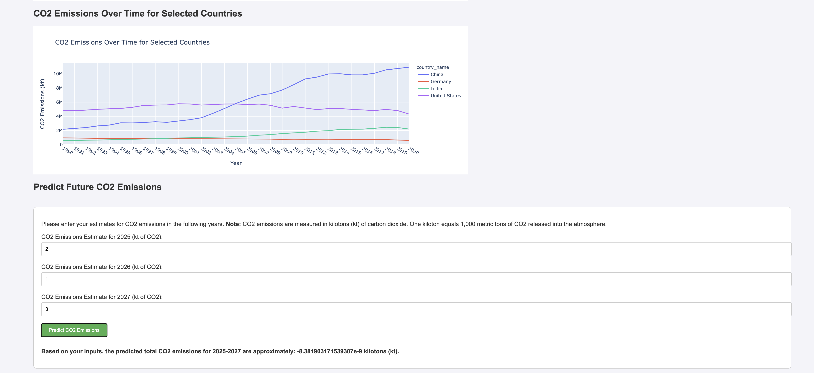

# CO2 Emission Prediction Project



## Project Overview
The **CO2 Emission Prediction Project** is aimed at analyzing historical CO2 emissions data and predicting future emissions using machine learning models. The project uses a web-based dashboard where users can visualize emissions data and make predictions based on historical trends.

## Features
- **Data Analysis**: Explore CO2 emissions data from various countries over multiple decades.
- **Machine Learning**: Predict future CO2 emissions using a trained Linear Regression model.
- **Interactive Visualizations**: Use Plotly to visualize trends and insights in emissions data.
- **Web Application**: A Flask-based web app to interact with the model and visualizations.

## Project Structure

```
CO2-Emission-Prediction-Project/
│
├── data/
│   ├── raw/                         # Raw datasets
│   ├── cleaned/                     # Cleaned and preprocessed datasets
│   └── database/                    # Database exports
│
├── notebooks/                       # Jupyter notebooks for data exploration, preprocessing, and modeling
├── models/                          # Serialized machine learning models
├── static/                          # Static files (CSS, JS, images)
├── templates/                       # HTML templates for the web app
├── scripts/                         # Python scripts for data cleaning, training, and predictions
├── app/                             # Flask app initialization and routes
├── config/                          # Runtime configuration settings
├── tests/                           # Unit tests for the project
├── docs/                            # Documentation (proposal, data sources, model explanation)
├── requirements.txt                 # Python dependencies
├── README.md                        # Project overview and setup instructions
└── LICENSE                          # Project license (if applicable)
```

## Setup Instructions

### 1. Clone the Repository
```
git clone https://github.com/maslla100/CO2emissions
cd CO2-Emission-Prediction-Project
```

### 2. Install Python Dependencies
Make sure you have Python 3.x installed. Install the necessary dependencies using `requirements.txt`:
```
pip install -r requirements.txt
```

### 3. Set Up the Database
Run the database setup script to create the necessary tables in your SQLite database:
```
python scripts/database_setup.py
```

### 4. Run the Flask App
Start the Flask web app:
```
python app/__init__.py
```
The app will be available at `http://127.0.0.1:5000/`.

### 5. Access the Dashboard
Open a web browser and visit `http://127.0.0.1:5000/` to explore the CO2 emissions data and make predictions using the trained model.

## Usage

### 1. Data Exploration
- Use the Jupyter notebooks in the `notebooks/` directory to explore and clean the dataset.

### 2. Training the Model
- Run the `train_model.py` script located in the `scripts/` directory to train the model on the cleaned data.

### 3. Making Predictions
- The Flask app allows you to make predictions via the web interface or through the `/api/predict` endpoint.

## License
This project is licensed under the MIT License. See the `LICENSE` file for more details.

## Contributing
Contributions are welcome! Please feel free to submit a pull request or open an issue on the repository.

## Contact
For questions or feedback, please contact:
- **Luis Llamas** (Project Lead) - luis.llamas@maslla.com
```

# Future Improvements
- Explore the use of more complex models (e.g., Random Forest, XGBoost) for better accuracy.
- Add real-time data integration from external sources to enhance the model's predictions.
- Expand the model to include other environmental factors such as deforestation and renewable energy usage.
